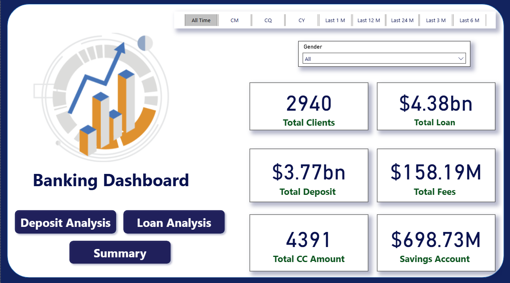
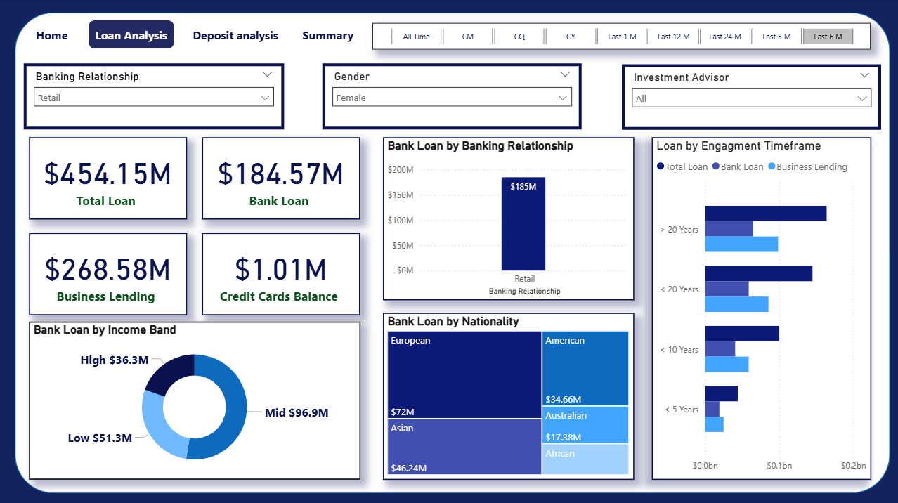
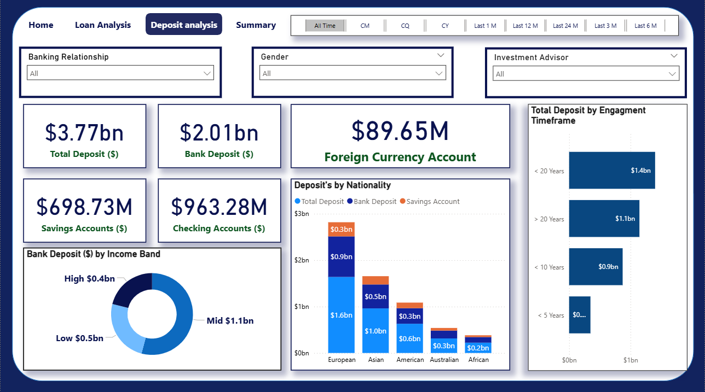
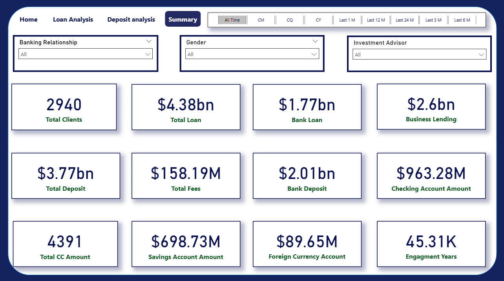
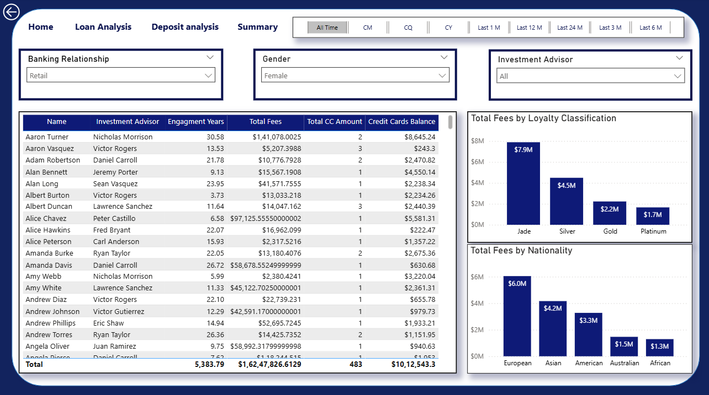

# Banking Analytics

> This project focuses on designing an interactive Banking Dashboard with **Power BI**, handling every stage of analysis — from **data cleaning** and shaping to **EDA** and **charts**.

---

## Project overview

- Cleaned and structured the Banking dataset for accuracy and consistency.
- Performed exploratory data analysis (EDA) to assess loan and deposit performance.
- Derived actionable insights on customer behavior, balances, and growth trends.
- Built an interactive Power BI dashboard to visualize results and support data-driven decisions.

---

## Tech stack
- **Programming:** Python (pandas, NumPy, matplotlib, seaborn)
- **Visualization:** Power BI
- **Other tools:** Git, GitHub

---

## Dashboard
The Power BI dashboard includes:
- **Home:** Overview of the banking dataset with key statistics and visual insights.
- **Loan Analysis:** Overview of loan patterns, types, and target customer segments.
- **Deposit Analysis:** Overview of deposit distribution, categories, and customer groups.
- **Summary:** Final key Statistics from EDA combined.
- **Drill Through:** Overview of Investment Advisor and Bank fees.

---
**Home**

**Loan Analysis**

**Deposit Analysis**

**Summary**

**Drill Through**

